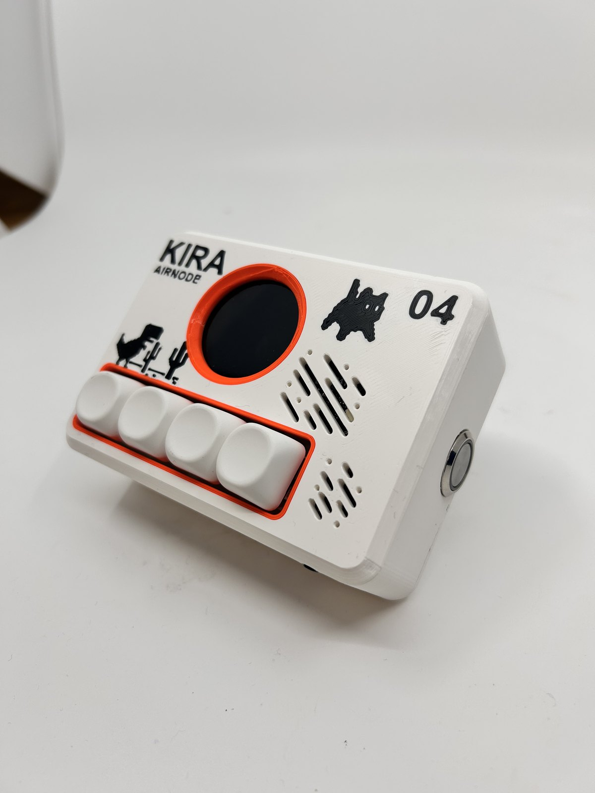
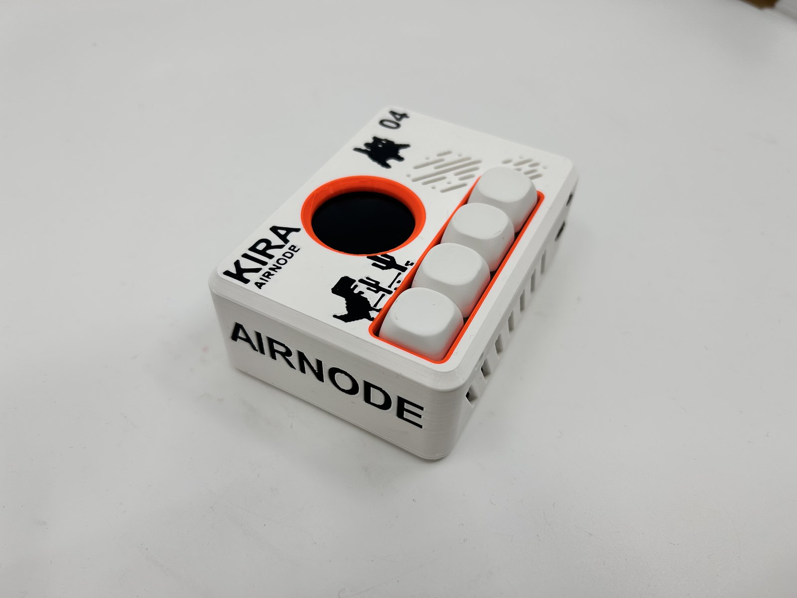
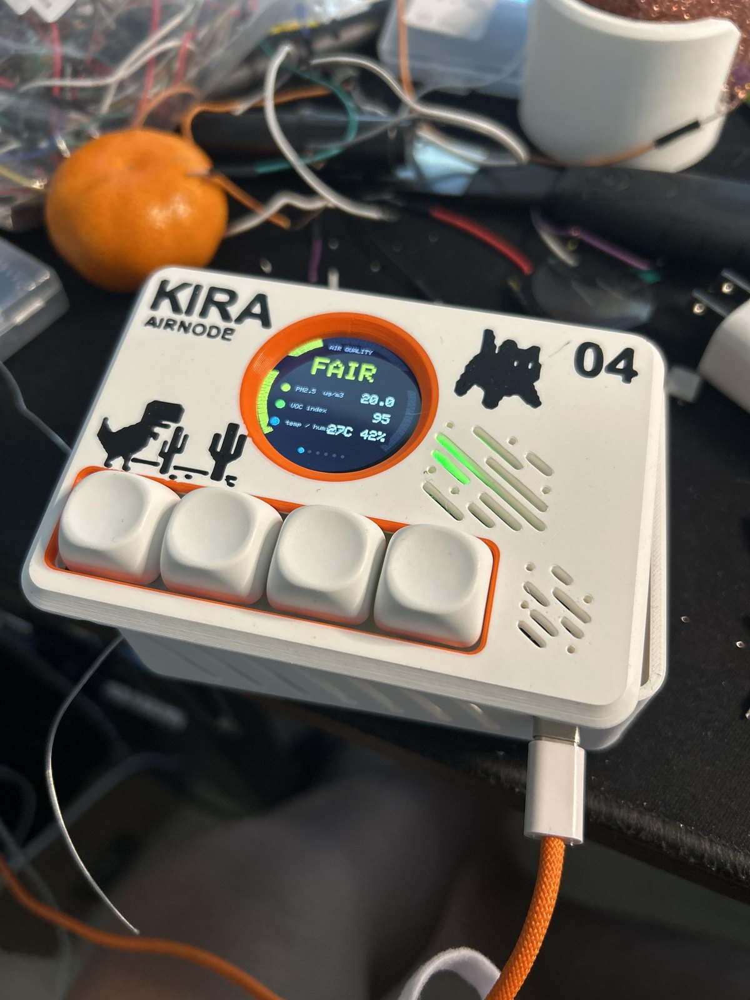
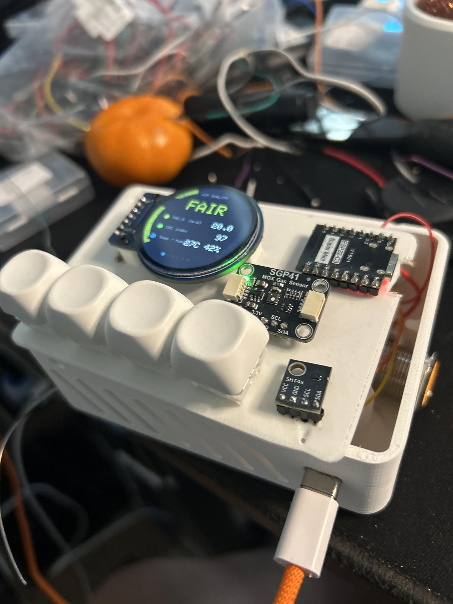
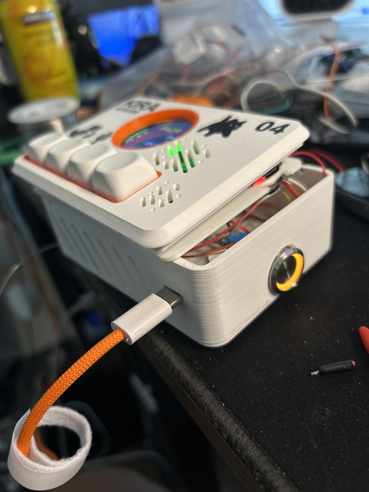
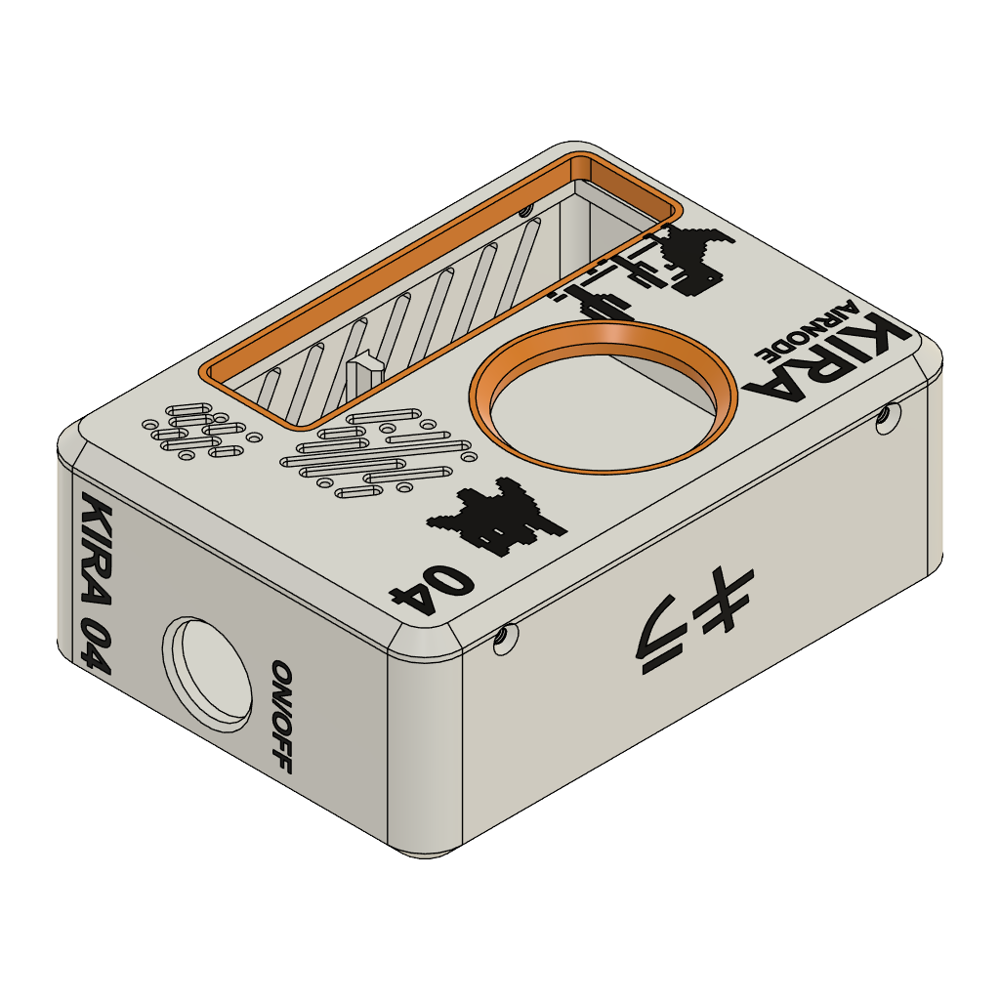

# AirNode Room Sensor

> [!WARNING]
> **AirNode is an ongoing, unfinished prototype.** The PCB, enclosure, firmware, pin assignments, and documentation may change. This revision has not completed long-term validation, calibration, or product safety testing and is not production ready.

AirNode is an ESP32-C3 based indoor air-quality monitor in a compact 70 mm × 100 mm enclosure. It combines a round color display, four buttons, an audible alarm, and connections for environmental sensor modules.

## Current capabilities

- ESP32-C3 SuperMini with Wi-Fi and Bluetooth LE
- 1.28-inch round SPI TFT
- SHT40 temperature and humidity sensor
- SCD40 carbon-dioxide sensor connection
- SGP41 VOC and NOx sensor connection
- SPS30 particulate-matter sensor connection
- Back-mounted passive piezo buzzer on GPIO20
- Four buttons: Up, Down, Select, and Back
- Two-layer 70 mm × 100 mm PCB with 8 mm corner radii
- 3D-printable enclosure source

## Project status

This repository records a working prototype and the next custom PCB revision. The photographed device uses development modules and point-to-point wiring; the KiCad design consolidates those connections onto a PCB.

| Area | Status |
| --- | --- |
| Schematic ERC | Pass: 0 violations |
| PCB connectivity | Pass: 0 unconnected items |
| PCB DRC | No shorts or clearance violations; one intentional dangling-via warning at the TFT CS layer transition |
| Enclosure | Prototype printed and assembled; PCB fit still requires physical verification |
| Firmware | Working prototype shown; source has not been added to this repository yet |
| Sensor calibration | In progress |
| Production testing | Not started |

## Documentation

- [Hardware and pin assignments](docs/HARDWARE.md)
- [Assembly guide](docs/ASSEMBLY.md)
- [First power-on and validation](docs/BRINGUP.md)
- [Firmware status and requirements](docs/FIRMWARE.md)
- [Enclosure and mechanical fit](docs/ENCLOSURE.md)
- [External USB-C programming connection](docs/USB-C-extension.md)
- [Bill of materials](BOM.csv)
- [Change log](CHANGELOG.md)

## Repository contents

- `Room Sensor.kicad_pro` — KiCad project
- `Room Sensor.kicad_sch` — schematic source
- `Room Sensor.kicad_pcb` — PCB layout source
- `RoomSensor_Libraries/` — project symbols and footprints
- `V.2.3mf` — printable enclosure source
- `Room Sensor.step` — PCB 3D export
- `BOM.csv` — bill of materials
- `manufacturing/gerbers/` — fabrication outputs for the current revision

Open `Room Sensor.kicad_pro` with KiCad 10 or newer. Review the schematic, PCB, and fabrication files together before ordering boards because the project remains under development.

## Prototype gallery

### Assembled enclosure

### Working development prototype

### Internal development build

These photos show development wiring and module placement. They do not represent the final PCB assembly.

| Open prototype | Assembly in progress |
| --- | --- |
|  |  |

## Enclosure files

[Download `V.2.3mf`](V.2.3mf)

## Before building

1. Read the [hardware notes](docs/HARDWARE.md) and confirm that your modules match the listed pin order and voltage.
2. Verify the exact dimensions and pad spacing of every purchased breakout board. Visually similar modules often differ.
3. Inspect the fabrication files and run ERC and DRC with your installed KiCad version.
4. Assemble and test one prototype before ordering multiple boards.
5. Follow the staged checks in the [bring-up guide](docs/BRINGUP.md).

## License

Hardware design files are released under the CERN Open Hardware Licence Version 2 — Strongly Reciprocal. See [LICENSE](LICENSE).
