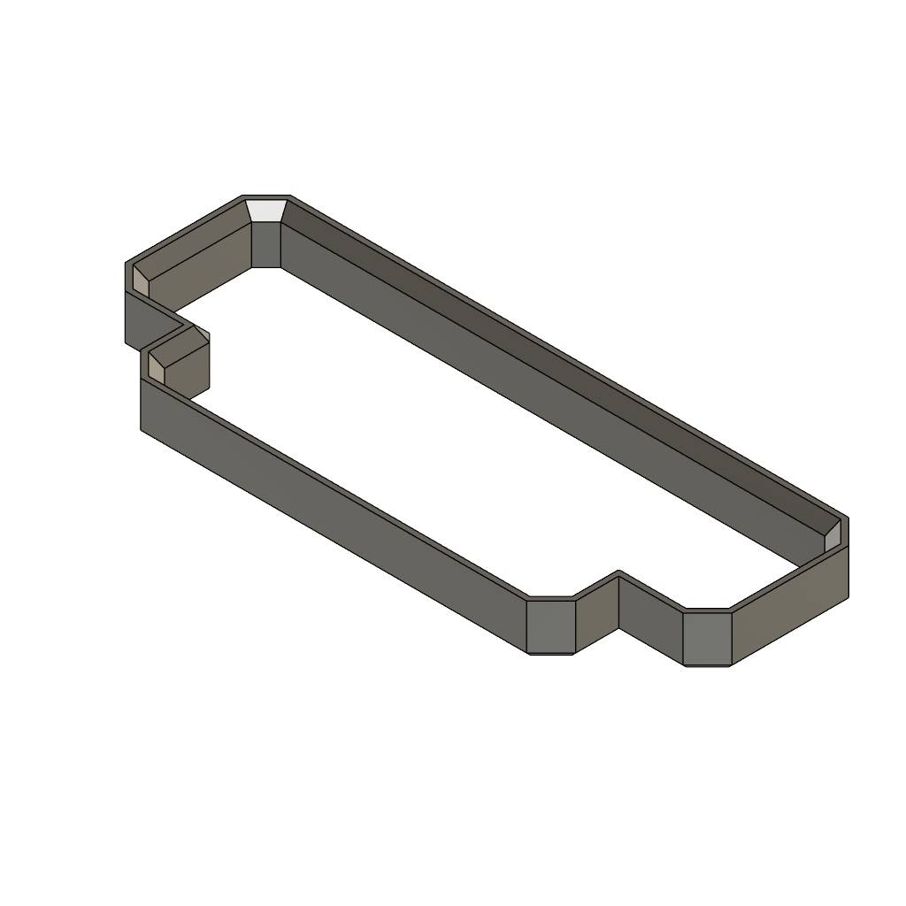

# AirNode Room Sensor

AirNode is an ESP32-C3 based indoor air-quality monitor designed for a compact 70 mm × 100 mm enclosure. The board combines local display and alarm controls with connectors for temperature, humidity, carbon dioxide, particulate matter, VOC, and NOx sensing.

## Features

- ESP32-C3 SuperMini controller with Wi-Fi and Bluetooth LE
- 1.28-inch round SPI TFT connection
- SHT40 temperature and humidity connection
- SCD40 carbon-dioxide connection
- SGP41 VOC and NOx connection
- SPS30 particulate-matter connection
- Passive piezo alarm on GPIO20
- Four user buttons; Select uses GPIO9
- Two-layer PCB with a 70 mm × 100 mm rounded outline
- Printable enclosure source in `V.2.3mf`

## Repository contents

- `Room Sensor.kicad_sch` — KiCad schematic
- `Room Sensor.kicad_pcb` — KiCad PCB layout
- `Room Sensor.kicad_pro` — KiCad project settings
- `RoomSensor_Libraries/` — project-specific symbols and footprints
- `V.2.3mf` and `cover.3mf` — enclosure models
- `Room Sensor.step` — PCB 3D export
- `BOM.csv` — bill of materials
- `manufacturing/gerbers/` — generated fabrication outputs
- `docs/USB-C-extension.md` — external USB-C flashing connection notes

## Enclosure preview

### Main enclosure

[Download the main enclosure 3MF](V.2.3mf)

### Cover insert

[Download the cover 3MF](cover.3mf)

## Current hardware status

This is a prototype revision intended for validation before sale or production.

- ERC: 0 violations
- PCB connectivity: 0 unconnected items
- PCB DRC: no shorts or clearance violations; one intentional dangling-via warning remains at the TFT CS layer transition
- Board outline: 70 mm × 100 mm with 8 mm corner radius
- TFT1 is shifted 1 mm right and 2 mm upward from its earlier location
- BZ1 is mounted on the back side
- SHT40 is on the front; SCD40 is on the back

Before ordering a production batch, verify all physical module outlines, enclosure alignment, airflow, USB wiring, and sensor readings with an assembled prototype.

## USB-C programming

The ESP32-C3 native USB interface uses GPIO18 for D− and GPIO19 for D+. The current SuperMini footprint does not expose those pins on its headers. The enclosure USB-C receptacle therefore connects through a short internal USB extension to a male USB-C breakout plugged into the SuperMini. See `docs/USB-C-extension.md`.

## Opening the project

Open `Room Sensor.kicad_pro` with KiCad 10 or newer. The project uses the included symbol and footprint tables.

## License

Hardware design files are released under CERN Open Hardware Licence Version 2 — Strongly Reciprocal. See `LICENSE`.
